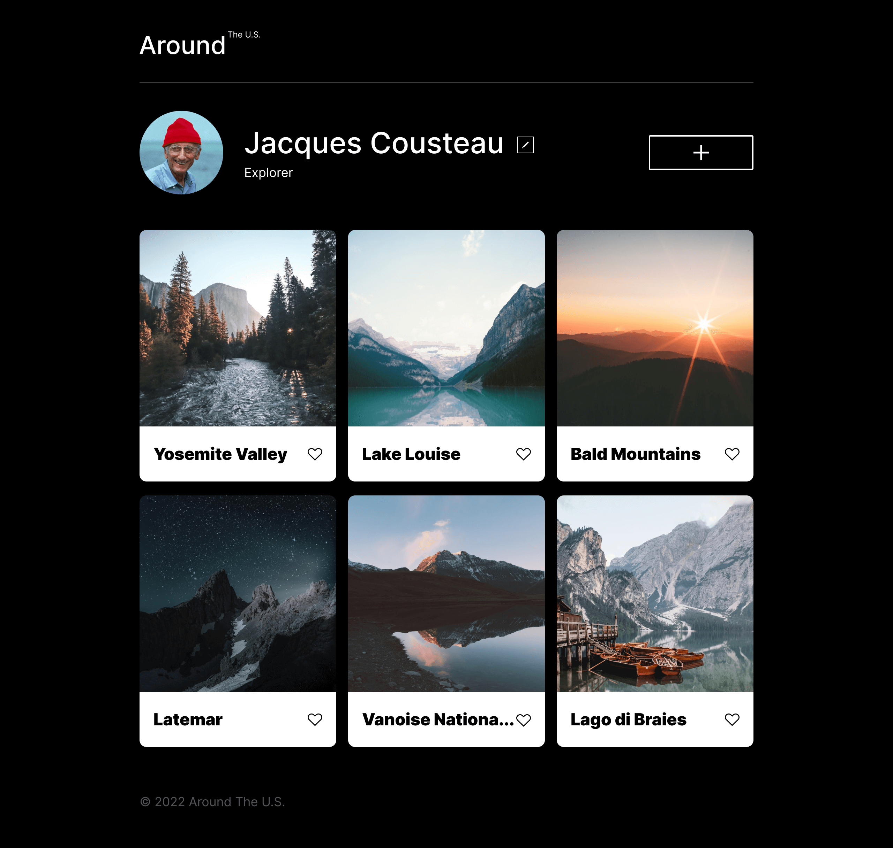
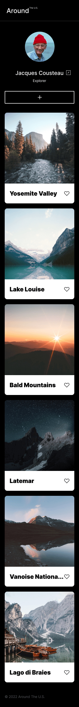

# Project 3: Around The U.S.

This project is the first step of a social media website's prototype, it was made using advanced HYMl and CSS in order to reach an adaptative and responsive design, as well as all other features involved, so all that makes the user experience as smooth as posible, .

## Project Description

"Around The U.S." is the first prototype's stage of a website designed specially for travelers all around the U.S. who want to share their experiencies and photos. This first prototype's stage shows exatly how the website would look like in different screen sizes, as well as its minimalist and handy layout and usage. This project was created using advanced HTML and CSS, based on the Figma design brief.

## Project Features

- Semantic HTML5
- BEM Methodology
- Flat BEM file structure
- Flexbox and Grid
- CSS transition and transform
- Responsive design
- CSS media queries

## Website
Link to the website:
-[Around the U.S.](https://ixantho.github.io/se_project_aroundtheus/)

## Figma

- [Link to the project on Figma](https://www.figma.com/file/ii4xxsJ0ghevUOcssTlHZv/Sprint-3%3A-Around-the-US?node-id=0%3A1)

## Images

- Website's view on screens of 1280px width.

- Website's view on screens of 320px width.

## Project Video explanation

- [Link to the video on Google Drive](https://drive.google.com/file/d/19MmlygNprgd_BG0C09avjoH7KvJ85Pzp/view?usp=share_link)
